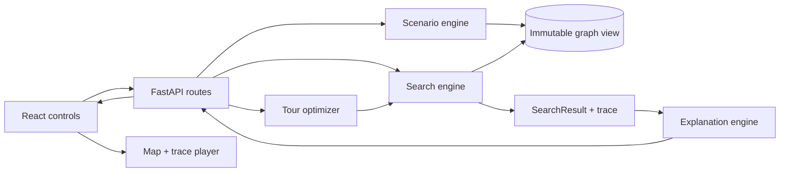

# Kiến trúc hệ thống

## Mục tiêu thiết kế

- Search engine kiểm thử được mà không cần HTTP hoặc trình duyệt.
- Frontend phát lại event trace, không điều khiển từng bước chạy thuật toán.
- Demo chính chạy trên dataset snapshot để tái lập và không phụ thuộc API trả phí.
- Explanation sinh từ cost breakdown và guarantee có cấu trúc.

## Luồng chính

## Boundary theo thư mục

| Module | Trách nhiệm | Không được làm |
|---|---|---|
| `backend/app/api` | Validate request, gọi use case, serialize response | Chứa logic search |
| `backend/app/core` | Graph Loader, immutable Graph/Node/Edge/Scenario/Cost contracts, ScenarioCostEngine và result contracts | Import FastAPI hoặc mutate graph |
| `backend/app/algorithms` | BFS, DFS, UCS, A*, Greedy, Bidirectional | Mutate graph, render UI |
| `backend/app/optimization` | Pairwise matrix, Held-Karp, Nearest Neighbor | Tự định nghĩa cost khác search |
| `backend/app/explanation` | Breakdown, alternative, guarantee, limitations | Tạo số liệu không có trong result |
| `frontend/src/features` | Controls, map, trace player, metrics | Cài lại thuật toán search |

## Hợp đồng kết quả

Mọi thuật toán trả về cùng mô hình `SearchResult(path, metrics, trace, guarantee,
explanation)`. Trace dùng các event `OPEN`, `EXPAND`, `RELAX`, `CLOSE`, `GOAL`,
`FAIL`; UI chỉ phát lại danh sách này. Tie-break mặc định: `g` thấp hơn, sau đó
`node_id` tăng dần.

`backend/app/core/cost.py` cung cấp `ScenarioCostEngine`, các preset
`BALANCED`, `PEAK_TRAFFIC`, `RAIN_SAFE` và breakdown bất biến cho edge/route.
Engine nhận graph contract, không import FastAPI và không mutate graph.

## API dự kiến

| Endpoint | Trạng thái | Mục đích |
|---|---|---|
| `GET /api/v1/health` | Có | Readiness cơ bản |
| `GET /api/v1/dataset/meta` | Có | Version, provenance, limitations |
| `GET /api/v1/graphs` | Có | Liệt kê graph folder hợp lệ trong fixture root |
| `GET /api/v1/graphs/{graph_id}` | Có | Node/Edge/Scenario cho graph explorer |
| `GET /api/v1/locations` | Kế tiếp | Node/POI có thể chọn |
| `GET /api/v1/scenarios` | Kế tiếp | Scenario và cost preset |
| `POST /api/v1/search` | Kế tiếp | Two-point result + trace |
| `POST /api/v1/optimize-tour` | Sau search | Visiting order + subpaths |
| `POST /api/v1/compare` | Sau search | Cùng input, nhiều thuật toán |

## Graph Loader contract

`backend/app/core/graph.py` cung cấp `GraphLoader.from_directory`, `from_csv`,
`from_json` và `load_graph`. Loader tạo các model bất biến trong
`backend/app/core/contracts.py`. Graph là directed-only; neighbor được sort
deterministic theo `(to_node_id, edge_id)` và mỗi scenario được biểu diễn bằng
`GraphView` lọc `closed_edge_ids`, không thay đổi graph gốc. Chi tiết field và
ví dụ input nằm trong [graph-format.md](graph-format.md).

Graph explorer không nhận filesystem path tùy ý từ frontend. Backend chỉ khám
phá folder dưới `data/fixtures`, tạo `graph_id` tương đối, kiểm tra đường dẫn sau
khi resolve vẫn nằm trong fixture root rồi mới load. Frontend gọi catalog, cho
chọn dataset/scenario và vẽ Node/Edge; edge đóng vẫn có trong payload với
`is_closed=true` để bản đồ hiển thị khác màu.

## Vì sao không dùng Next.js

Ứng dụng này là một client-side visualization gọi API Python, không cần SSR, SEO
hay server actions. Vite giảm lớp framework không phục vụ rubric và phù hợp với
giới hạn React Leaflet hoạt động phía client. Nếu sau này cần auth, persistence
hoặc public portal có SSR, quyết định này phải được xem lại bằng ADR mới.
