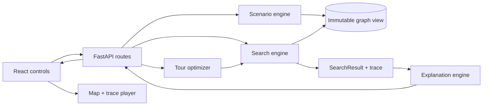

# Kiến trúc hệ thống

## Processed graph catalog

Catalog graph đọc hai root cố định: `data/fixtures` và `data/processed`. Fixture giữ
graph ID tương đối cũ; processed graph có prefix `processed/`. API resolve path và xác
nhận candidate qua `GraphLoader.discover_directories` trong đúng root, vì vậy client
không thể yêu cầu path filesystem tùy ý. UI ưu tiên
`processed/thu_duc_market_v1.0.0` nhưng thuật toán vẫn chỉ phụ thuộc immutable graph
contract, không phụ thuộc FastAPI hay loại dataset.

## Mục tiêu thiết kế

- Search engine kiểm thử được mà không cần HTTP hoặc trình duyệt.
- Frontend phát lại event trace, không điều khiển từng bước chạy thuật toán.
- Demo chính chạy trên dataset snapshot để tái lập và không phụ thuộc API trả phí.
- Explanation sinh từ cost breakdown và guarantee có cấu trúc.

## Map renderer

Frontend dùng MapLibre GL JS. OpenFreeMap là basemap best-effort; Node, Edge và route
được chuyển từ API payload sang ba GeoJSON source và render bằng GPU layers. Snapshot
ranh TP Thủ Đức cũ là GeoJSON source thứ tư, chỉ dùng làm lớp ngữ cảnh. Basemap
không tham gia snapping, topology, scenario hoặc cost. Khi remote style lỗi, renderer
dùng style nền trung tính cục bộ và vẫn hiển thị graph.

Landmark graph chỉ gửi node `selectable=true` lên UI. Mỗi node có marker dạng nút nhỏ
tròn trắng viền xanh và hitbox trong suốt; START/GOAL vẫn dùng style endpoint riêng.
Dataset cũ vẫn có display label deterministic từ `road_name`, nhưng release mặc định chỉ
dùng tên POI OSM source-backed.

Khi chọn endpoint, click ngoài marker được snap phía client tới node có thể chọn gần nhất
trong 200 m. Search request vẫn chỉ chứa `node_id` hợp lệ. Landmark edge giữ
`path_coordinates_json`, là polyline shortest path đã tổng hợp từ mạng nguồn UTraffic
8.952/14.043; thuật toán chạy trên graph nén 65/178. Graph capacity 3.229/5.057 vẫn là
benchmark riêng.

Frontend map scope chỉ giữ catalog row `processed/thu_duc_landmarks_v1.0.0`. Pilot 90 node
và capacity graph vẫn tồn tại qua API/script benchmark, nhưng không được trình bày trong
dropdown map vì không đúng mục tiêu 65 landmark hiện tại.

Camera dùng `maxBounds=B`, `renderWorldCopies=false` và min zoom 10.5 để chỉ hoạt động
trong vùng nghiên cứu. B được lấy từ bounding rectangle của polygon ranh A rồi cộng 3%
padding (tối thiểu 0,004 độ), vì vậy B bao trọn A và vẫn có một vành ngữ cảnh nhỏ bên
ngoài đường đỏ. Nếu boundary API lỗi, renderer fallback về context ring động của graph
và cũng giới hạn camera trong rectangle fallback đó.

Thay đổi `startId`/`goalId` chỉ cập nhật GeoJSON node state, không gọi `flyTo` hoặc
`fitBounds`. Renderer giữ nguyên viewport người dùng đang quan sát và gắn hai HTML marker
dạng ghim lớn vào đúng tọa độ endpoint: START màu cam, GOAL màu hồng. Các marker này chỉ
tồn tại cho endpoint đã chọn và được vẽ chồng lên circle node gốc thay vì thay thế node.
`fitBounds` chỉ dùng khi nạp graph, nạp boundary mới hoặc khi người dùng bấm nút reset
viewport.

## Luồng chính

## Boundary theo thư mục

| Module | Trách nhiệm | Không được làm |
|---|---|---|
| `backend/app/api` | Validate request, gọi use case, serialize response | Chứa logic search |
| `backend/app/core` | Graph Loader, immutable Graph/Node/Edge/Scenario/Cost contracts, ScenarioCostEngine và result contracts | Import FastAPI hoặc mutate graph |
| `backend/app/algorithms` | BFS, DFS, UCS, A*, Greedy, Bidirectional | Mutate graph, render UI |
| `backend/app/optimization` | Pairwise matrix, Held-Karp, Nearest Neighbor | Tự định nghĩa cost khác search |
| `backend/app/explanation` | Breakdown, alternative, guarantee, limitations | Tạo số liệu không có trong result |
| `frontend/src/features` | Controls, map, trace player, metrics | Cài lại thuật toán search |

Frontend Pathfinder AI nạp catalog graph, locations và scenarios từ API. Mỗi lần
chạy, UI gửi lựa chọn start/goal/algorithm/scenario tới `POST /search` hoặc
`POST /compare`, sau đó chỉ trực quan hóa `path`, `trace`, `metrics`, `guarantee`
và `explanation` trả về; không duy trì cost/search logic phía trình duyệt.

## Hợp đồng kết quả

Mọi thuật toán trả về cùng mô hình `SearchResult(path, metrics, trace, guarantee,
explanation)`. Trace dùng các event `OPEN`, `EXPAND`, `RELAX`, `CLOSE`, `GOAL`,
`FAIL`; UI chỉ phát lại danh sách này. Tie-break mặc định: `g` thấp hơn, sau đó
`node_id` tăng dần.

`backend/app/core/cost.py` cung cấp `ScenarioCostEngine`, các preset
`BALANCED`, `PEAK_TRAFFIC`, `RAIN_SAFE` và breakdown bất biến cho edge/route.
Engine nhận graph contract, không import FastAPI và không mutate graph.

## API dự kiến

| Endpoint | Trạng thái | Mục đích |
|---|---|---|
| `GET /api/v1/health` | Có | Readiness cơ bản |
| `GET /api/v1/dataset/meta` | Có | Version, provenance, limitations |
| `GET /api/v1/graphs` | Có | Liệt kê graph folder hợp lệ trong fixture root |
| `GET /api/v1/graphs/{graph_id}` | Có | Node/Edge/Scenario cho graph explorer |
| `GET /api/v1/locations` | Có | Node/POI có thể chọn |
| `GET /api/v1/scenarios` | Có | Scenario và cost preset |
| `POST /api/v1/search` | Có | Two-point result + trace |
| `POST /api/v1/optimize-tour` | Có | Visiting order + subpaths |
| `POST /api/v1/compare` | Có | Cùng input, nhiều thuật toán |

API search dùng Pydantic schema trong `backend/app/api/models.py`, gọi
`SearchService` thay vì chứa logic thuật toán. Registry hiện hỗ trợ `UCS` và
`A_STAR`; A* dùng heuristic khoảng cách Haversine nhân trọng số distance của scenario,
fallback về `h=0` khi node thiếu tọa độ. Heuristic giữ admissible/consistent cho cost đa
thành phần theo ADR-0012. Chi tiết request, response và error status xem [api.md](api.md).

Tour optimizer nhận depot và 5–10 stop duy nhất, không cho depot lặp trong stops. Ma trận
chi phí có hướng được tạo qua cùng `SearchService` và scenario cost, sau đó Held-Karp tìm
nghiệm chính xác còn Nearest Neighbor cung cấp nghiệm heuristic để so sánh. Tên thuật toán
tour ngoài `HELD_KARP` và `NEAREST_NEIGHBOR` bị từ chối thay vì fallback ngầm.

## Graph Loader contract

`backend/app/core/graph.py` cung cấp `GraphLoader.from_directory`, `from_csv`,
`from_json` và `load_graph`. Loader tạo các model bất biến trong
`backend/app/core/contracts.py`. Graph là directed-only; neighbor được sort
deterministic theo `(to_node_id, edge_id)` và mỗi scenario được biểu diễn bằng
`GraphView` lọc `closed_edge_ids`, không thay đổi graph gốc. Chi tiết field và
ví dụ input nằm trong [graph-format.md](graph-format.md).

Graph explorer không nhận filesystem path tùy ý từ frontend. Backend chỉ khám
phá folder dưới `data/fixtures` và `data/processed`, tạo `graph_id` tương đối có prefix
cho processed, kiểm tra đường dẫn sau khi resolve vẫn nằm trong root tương ứng rồi mới
load. Frontend gọi catalog, cho
chọn dataset/scenario và vẽ Node/Edge; edge đóng vẫn có trong payload với
`is_closed=true` để bản đồ hiển thị khác màu.

## Vì sao không dùng Next.js

Ứng dụng này là một client-side visualization gọi API Python, không cần SSR, SEO
hay server actions. Vite giảm lớp framework không phục vụ rubric và phù hợp với
MapLibre GL JS hoạt động phía client. Nếu sau này cần auth, persistence
hoặc public portal có SSR, quyết định này phải được xem lại bằng ADR mới.
