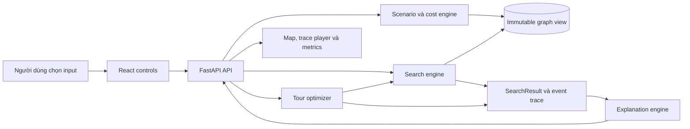
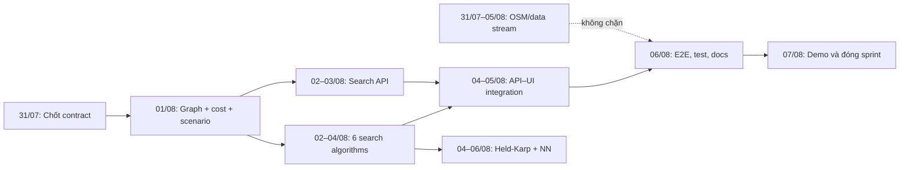

# FloodRoute HCMC — Tóm tắt đồ án và kế hoạch Trello 7 ngày

- Thời điểm rà soát: 31/07/2026
- Thời gian sprint: 31/07/2026–07/08/2026
- Quy mô nhóm: 4 người
- Trạng thái repository: bootstrap v0.1
- Trọng tâm sprint: backend và thuật toán trước, sau đó tích hợp API–frontend

## 1. Bản tóm tắt 60 giây để nói lại cho cả nhóm

**FloodRoute HCMC** là prototype học thuật giúp shipper xe máy tìm tuyến giao hàng tại
TP.HCM khi đường có thể kẹt xe hoặc ngập. Hệ thống không chỉ tìm đường ngắn nhất:
nó tính một chi phí tổng hợp từ khoảng cách, thời gian, ùn tắc và rủi ro, sau đó
giải thích vì sao tuyến được chọn tốt hơn một tuyến thay thế.

Đồ án phải giải được hai bài toán:

1. **Tìm đường hai điểm:** chọn điểm đầu, điểm cuối, kịch bản giao thông và thuật
   toán; hệ thống trả đường đi, chi phí, thời gian, số nút đã duyệt và trace từng
   bước.
2. **Tối ưu giao nhiều điểm:** chọn depot và 5–10 điểm giao; hệ thống đề xuất thứ
   tự ghé, ghép các chặng đường và nói rõ kết quả là tối ưu hay gần tối ưu.

Giá trị của đồ án nằm ở việc minh họa rõ sự khác nhau giữa BFS, DFS, UCS, A*,
Greedy, Bidirectional, Held-Karp và Nearest Neighbor trong một bối cảnh giao thông
Việt Nam. Đây **không phải** ứng dụng dẫn đường an toàn dùng ngoài đời thực, không
có traffic thời gian thực và chưa giải bài toán nhiều shipper/nhiều xe.

## 2. Đồ án làm gì và để làm gì?

### 2.1. Người dùng sẽ làm gì?

- Chọn điểm xuất phát, điểm đến và các điểm giao trung gian.
- Chọn thời gian/kịch bản: ngoài cao điểm, cao điểm hoặc mưa lớn.
- Chọn tiêu chí/preset chi phí và thuật toán.
- Xem graph/bản đồ, frontier, node đã duyệt và tuyến cuối theo từng bước.
- So sánh đường đi, khoảng cách, ETA, tổng cost, số node mở rộng và runtime.
- Đọc giải thích: tuyến được chọn vì sao, đoạn nào tạo khác biệt, tuyến thay thế
  kém hơn ở đâu và thuật toán có bảo đảm tối ưu hay không.

### 2.2. Nhóm cần chứng minh điều gì?

- Không phải lúc nào đường ngắn nhất theo khoảng cách cũng nhanh hoặc an toàn hơn.
- UCS tìm nghiệm tối ưu với cost không âm; A* phải khớp cost của UCS khi heuristic
  thỏa điều kiện đã công bố.
- BFS chỉ tối ưu số cạnh khi mỗi cạnh có cùng cost; DFS và Greedy có thể cho đường
  xấu, nên phải có phản ví dụ.
- Bidirectional chỉ được ghi bảo đảm đúng với biến thể và điều kiện dừng mà nhóm
  thật sự cài đặt.
- Held-Karp là nghiệm exact ở quy mô nhỏ; Nearest Neighbor nhanh hơn nhưng chỉ là
  heuristic và phải có case thể hiện approximation gap.
- Mọi con số trong phần giải thích phải truy ngược được về kết quả máy, không viết
  câu giải thích cố định rồi gắn vào mọi route.

### 2.3. Kết quả cuối đồ án cần có

| Nhóm đầu ra | Nội dung bắt buộc |
|---|---|
| Source code | React/TypeScript/Vite, FastAPI, core Python độc lập framework |
| Dataset | Graph có hướng, thuộc tính đường, provenance, version, checksum và nhãn dữ liệu |
| Thuật toán hai điểm | BFS, DFS, UCS, A*, Greedy Best-First, Bidirectional Search |
| Tối ưu đa điểm | Held-Karp DP và Nearest Neighbor trên cùng pairwise cost matrix |
| GUI | Controls, map/graph, trace player, metrics, comparison và explanation |
| Kiểm thử/thực nghiệm | Golden cases, phản ví dụ, batch comparison và kết quả tái lập |
| Hồ sơ nộp | Báo cáo kỹ thuật, slide, video demo, mô tả dataset và ZIP đúng quy định |

## 3. Hệ thống dự kiến hoạt động như thế nào?

Các nguyên tắc không được phá:

- Thuật toán dùng contract trong `backend/app/core/contracts.py`, không import
  FastAPI và không mutate graph.
- Tie-break phải deterministic; cùng dataset/input phải ra cùng path và trace.
- Frontend chỉ phát lại trace, không cài lại thuật toán trong React.
- Raw data là bất biến. Dữ liệu mới phải tạo version mới, cập nhật manifest và
  checksum.
- Fixture và giả định luôn mang nhãn `SIMULATED` hoặc `ASSUMPTION`.
- Nếu đổi API contract, cost model, heuristic claim hoặc schema thì phải tạo ADR.

## 4. Trạng thái thực tế sau khi rà soát repository

### 4.1. Đã có và đang chạy được

| Hạng mục | Bằng chứng hiện tại |
|---|---|
| Frontend | Dashboard responsive, React Leaflet, hai scenario và route preview |
| Backend API | `GET /api/v1/health`, `GET /api/v1/dataset/meta`, CORS local |
| Core contract | `TraceEvent`, `RouteMetrics`, `SearchResult` dạng dataclass bất biến |
| Fixture | 6 node, 14 directed edge, 2 scenario, 4 golden case; đều gắn `SIMULATED` |
| Data governance | raw/interim/processed/fixtures/schemas/registry, checksum và validator |
| Tài liệu | README, architecture, data management, ADR, progress log và kế hoạch gốc |
| Kiểm tra 31/07 | Data PASS; backend 2 test PASS; frontend 3 test PASS; Vite build PASS |

### 4.2. Chưa được triển khai

| Mức ưu tiên | Khoảng trống |
|---|---|
| P0 | Graph model/loader bất biến dùng chung cho thuật toán |
| P0 | Cost function, scenario engine, edge closure và restriction |
| P0 | BFS, DFS, UCS, A*, Greedy và Bidirectional — thư mục hiện mới có README |
| P0 | `POST /search` và API model/validation cho search |
| P1 | Pairwise cost matrix, Held-Karp, Nearest Neighbor và `/optimize-tour` |
| P1 | Trace player thật; frontend hiện hiển thị dữ liệu hard-code |
| P1 | Comparison và explanation sinh từ result thật |
| P1 | OSM road graph 80–150 node và map-match 24 flood hotspot |
| P2 | Experiment runner, báo cáo, slide, video và đóng gói release |

### 4.3. Rủi ro và điểm cần hiểu thống nhất

- `routing_dataset_status` vẫn là `NOT_READY`; chưa được trình bày fixture như dữ
  liệu định tuyến thực tế.
- `npm test` chỉ chạy trọn bộ khi Python environment đã có dependency dev. Trong
  lần rà soát, Python hệ thống thiếu `pytest`, còn
  `.venv\Scripts\python.exe -m pytest backend/tests` chạy PASS.
- UI hiện đổi route bằng object hard-code, chưa gọi search engine.
- Contract hiện chưa đủ mô tả graph, scenario, cost breakdown, frontier max,
  generated nodes hoặc failure status. Nhóm phải chốt phần mở rộng trước khi bốn
  người code song song.
- Heuristic A* chưa tồn tại. Không được ghi “A* optimal” trước khi có định nghĩa,
  điều kiện áp dụng và test đối chiếu UCS.
- OSM extraction/map-match có thể kéo dài; backend tuần này phải chạy độc lập trên
  toy fixture để data thật không chặn đường găng.

## 5. Mục tiêu sprint 31/07–07/08/2026

### 5.1. Sprint goal

Tạo một lát cắt end-to-end chạy thật:

> Người dùng chọn hai node, scenario và một trong sáu thuật toán; FastAPI chạy
> thuật toán trên toy graph, trả `SearchResult` deterministic có metrics/trace/
> guarantee/explanation; React gọi API và phát lại trace. Đồng thời có bản đầu của
> tối ưu đa điểm và pipeline OSM không chặn đường găng.

### 5.2. Definition of Done của sprint

Sprint chỉ được gọi là đạt khi:

- [ ] Cả sáu thuật toán hai điểm chạy qua cùng interface và không mutate graph.
- [ ] UCS/A* khớp optimal cost trên golden cases phù hợp.
- [ ] Có test `start=goal`, unreachable, directed/one-way, cycle, tie-break,
  closed edge, invalid node và negative cost.
- [ ] Greedy/DFS có case chứng minh không tối ưu; guarantee trả về đúng.
- [ ] `GET /locations`, `GET /scenarios`, `POST /search` chạy và có API tests.
- [ ] Frontend không còn dùng route/metric hard-code cho luồng search chính.
- [ ] Trace có thể play/pause/step/reset và phân biệt frontier/visited/final path.
- [ ] Held-Karp và Nearest Neighbor chạy ít nhất trên `TC04_MULTI_STOP`; Held-Karp
  được đối chiếu brute force ở case nhỏ.
- [ ] Mọi fixture/metric mô phỏng vẫn hiển thị `SIMULATED`.
- [ ] Test data, backend, frontend và build đều PASS trong môi trường đã tài liệu hóa.
- [ ] Progress, changelog, architecture/data/API docs và ADR liên quan được cập nhật.
- [ ] Có demo cố định và mọi thành viên giải thích được cost, guarantee, dataset
  limitation và ít nhất một module không phải phần mình viết.

## 6. Cách tạo board Trello

### 6.1. Tên board và các list

Tên board: **FloodRoute HCMC — Sprint 01 — Backend-first**

Tạo list theo đúng thứ tự:

1. `00 — Sprint Goal & Rules`
2. `01 — Ready`
3. `02 — In Progress`
4. `03 — Review / Test`
5. `04 — Blocked`
6. `05 — Done`

Quy ước:

- Mỗi người chỉ có tối đa **một card In Progress**.
- Card chỉ sang `Review / Test` khi đã có code, test và docs theo checklist.
- Card chỉ sang `Done` khi reviewer khác owner xác nhận acceptance criteria.
- Blocker trên 4 giờ phải chuyển sang `Blocked`, ghi nguyên nhân và người cần hỗ trợ.
- Không tạo card “làm backend” chung chung; mỗi card dưới đây là một đơn vị có thể
  nghiệm thu.

### 6.2. Labels

| Label | Ý nghĩa |
|---|---|
| `P0 — Critical` | Chặn vertical slice hoặc chặn nhiều người |
| `P1 — Required` | Cần đạt trong sprint nhưng không chặn việc bắt đầu |
| `P2 — Stretch` | Chỉ làm sau khi P0/P1 PASS |
| `Backend` | Core, scenario, API |
| `Algorithm` | Search/optimization |
| `Data` | OSM, map-match, schema, provenance |
| `Frontend` | React, map, trace player |
| `Test/Docs` | Automated tests, QA, ADR/progress/docs |

### 6.3. Vai trò bốn người

Thay `TV1`–`TV4` bằng tên thật ngay khi tạo board.

| Người | Primary owner | Cross-review bắt buộc |
|---|---|---|
| TV1 — Backend lead | Contract, graph/cost/scenario, API, explanation | Review thuật toán TV2 |
| TV2 — Search lead | 6 thuật toán two-point, trace và correctness tests | Review core/API TV1 |
| TV3 — Data & optimization lead | OSM/data QC, pairwise matrix, Held-Karp, NN | Review UI data/claims TV4 |
| TV4 — Frontend & QA lead | API integration, trace player, UI tests, demo | Review tests/guarantee TV2 |

Mỗi người phải có code/test và phải trình bày được phần cross-review; không giao
một người chỉ làm báo cáo, slide hoặc Trello.

## 7. Đường găng và mốc theo ngày

| Ngày | Mốc bắt buộc cuối ngày |
|---|---|
| 31/07 | Board sẵn sàng; API/core contract và biến thể Bidirectional được chốt bằng ADR |
| 01/08 | Immutable graph loader + scenario/cost chạy trên fixture; BFS/DFS PASS |
| 02/08 | UCS/A* chạy qua engine; `/locations`, `/scenarios`, `/search` có skeleton |
| 03/08 | UCS/A* golden tests PASS; frontend gọi được API và xử lý loading/error |
| 04/08 | Greedy/Bidirectional PASS; trace player chạy; pairwise matrix sẵn sàng |
| 05/08 | 6 thuật toán tích hợp; explanation/metrics thật; OSM candidate/QC report |
| 06/08 | Held-Karp/NN, E2E, regression, docs và test/build toàn bộ PASS |
| 07/08 | Demo nhóm, vấn đáp chéo, đóng card và chốt backlog sprint sau |

## 8. Các card Trello chi tiết

### Card TEAM-00 — Chốt contract, cost model và nguyên tắc tích hợp

- Owner: TV1
- Reviewer: TV2, TV3, TV4
- Due: 31/07/2026
- Labels: `P0 — Critical`, `Backend`, `Algorithm`, `Test/Docs`
- Estimate: 4 giờ
- Dependencies: không

Mục tiêu: tháo blocker lớn nhất trước khi code song song.

Checklist:

- [ ] Liệt kê input/output của graph view, scenario, edge cost và search.
- [ ] Chốt đơn vị và normalization của distance/time/congestion/flood risk.
- [ ] Chốt cách thể hiện closed edge, unreachable và invalid input.
- [ ] Chốt tie-break của từng priority queue.
- [ ] Chọn rõ biến thể Bidirectional; khuyến nghị Bidirectional UCS trên directed
  graph có trọng số không âm với reverse adjacency và điều kiện dừng đúng.
- [ ] Xác định trường cần bổ sung vào `SearchResult`, metrics, trace và explanation.
- [ ] Chốt JSON request/response của `/search`, `/optimize-tour`, `/compare`.
- [ ] Tạo ADR vì thay cost model/API contract/guarantee là quyết định đáng kể.
- [ ] Tạo test fixture/interface stub để TV1, TV2, TV3, TV4 dùng cùng một contract.

Đạt yêu cầu khi:

- ADR và contract được cả bốn người review.
- Một request/response mẫu serialize được và TypeScript type khớp Python schema.
- Không còn câu hỏi mở làm TV2 hoặc TV4 phải tự đoán interface.

### Card BE-01 — Immutable graph loader và deterministic graph view

- Owner: TV1
- Reviewer: TV2
- Due: 01/08/2026
- Labels: `P0 — Critical`, `Backend`, `Test/Docs`
- Estimate: 7 giờ
- Dependencies: `TEAM-00`

Checklist:

- [ ] Đọc nodes/edges/scenarios của `toy_graph_v0.1`.
- [ ] Validate unique ID, foreign key, directed edge và weight không âm.
- [ ] Tạo adjacency/reverse-adjacency chỉ đọc; neighbor luôn có thứ tự ổn định.
- [ ] Hỗ trợ tra node/edge, route reconstruction và path metrics.
- [ ] Không sửa fixture, graph hoặc edge khi chạy scenario/algorithm.
- [ ] Test graph rỗng, duplicate ID, missing FK, one-way và negative weight.
- [ ] Cập nhật architecture/API docs, progress và changelog liên quan.

Đạt yêu cầu khi:

- Loader đọc đúng 6 node/14 directed edge.
- Hai lần chạy cùng input tạo adjacency và kết quả cùng thứ tự.
- Test chứng minh graph trước và sau một search/scenario là như nhau.
- Module core không import FastAPI.

### Card BE-02 — Scenario/cost engine và search service

- Owner: TV1
- Reviewer: TV3
- Due: 02/08/2026
- Labels: `P0 — Critical`, `Backend`, `Algorithm`
- Estimate: 7 giờ
- Dependencies: `TEAM-00`, `BE-01`

Checklist:

- [ ] Áp dụng preset weight có tổng bằng 1.
- [ ] Tách free-flow time khỏi congestion để không cộng congestion hai lần.
- [ ] Áp dụng edge override, flood risk và closed edge theo scenario.
- [ ] Trả cost breakdown theo edge và toàn route.
- [ ] Tạo algorithm registry/dispatcher dùng chung, không đặt search logic trong API.
- [ ] Đo processing time chỉ quanh engine, không gồm animation.
- [ ] Test normal/rain, closure, invalid preset và deterministic result.

Đạt yêu cầu khi:

- `OFFPEAK_BALANCED` và `HEAVY_RAIN_SAFE` làm availability/cost của edge thay đổi
  đúng fixture.
- Cost route bằng tổng cost edge và mọi thành phần explanation truy được về breakdown.
- Search service gọi được implementation giả và sau đó thay bằng thuật toán thật
  mà không đổi API.

### Card BE-03 — API locations/scenarios/search/compare và explanation

- Owner: TV1
- Reviewer: TV4
- Due: 05/08/2026
- Labels: `P0 — Critical`, `Backend`, `Test/Docs`
- Estimate: 8 giờ
- Dependencies: `BE-02`, `ALG-03`

Checklist:

- [ ] Cài `GET /api/v1/locations`.
- [ ] Cài `GET /api/v1/scenarios`.
- [ ] Cài `POST /api/v1/search`.
- [ ] Cài `POST /api/v1/compare` sau khi `/search` ổn định.
- [ ] Validate node, scenario, algorithm và preset; lỗi có message hành động được.
- [ ] Serialize metrics, trace, guarantee, data status và limitations.
- [ ] Explanation nêu criterion, cost breakdown, đoạn quyết định, alternative,
  guarantee và dataset limitation; không bịa số.
- [ ] Viết API tests cho happy path, invalid input và unreachable.

Đạt yêu cầu khi:

- OpenAPI hiển thị schema và example đúng contract đã chốt.
- Cùng request gửi hai lần trả cùng path, cost và trace order; chỉ runtime được phép
  dao động.
- Response fixture luôn chứa `SIMULATED`.
- API không chứa implementation của BFS/DFS/UCS/A*.

### Card ALG-01 — Shared search utilities, BFS và DFS

- Owner: TV2
- Reviewer: TV1
- Due: 01/08/2026
- Labels: `P0 — Critical`, `Algorithm`, `Test/Docs`
- Estimate: 7 giờ
- Dependencies: `TEAM-00`, graph interface stub

Checklist:

- [ ] Tạo recorder cho `OPEN`, `EXPAND`, `RELAX`, `CLOSE`, `GOAL`, `FAIL`.
- [ ] Tạo path reconstruction và metrics dùng chung, tránh copy-paste.
- [ ] Cài BFS với neighbor/tie-break deterministic.
- [ ] Cài DFS iterative để tránh recursion depth và giữ traversal deterministic.
- [ ] Không dùng edge đóng; không mutate graph.
- [ ] Test start=goal, unreachable, cycle, one-way, tie-break.
- [ ] Thêm case chứng minh DFS không tối ưu; guarantee phải nói đúng giới hạn.

Đạt yêu cầu khi:

- BFS trả đường ít hop nhất trên unweighted interpretation, không tuyên bố optimal
  theo multi-criteria cost.
- DFS kết thúc trên graph có cycle và phản ví dụ cho thấy route có thể xấu.
- Trace step tăng liên tục, final event là `GOAL` hoặc `FAIL`.

### Card ALG-02 — UCS, A* và kiểm chứng heuristic

- Owner: TV2
- Reviewer: TV4
- Due: 03/08/2026
- Labels: `P0 — Critical`, `Algorithm`, `Test/Docs`
- Estimate: 9 giờ
- Dependencies: `BE-01`, `BE-02`, `ALG-01`

Checklist:

- [ ] Cài UCS bằng priority queue và hỗ trợ relax khi tìm cost tốt hơn.
- [ ] Cài A* dùng cùng cost/graph/search contract.
- [ ] Định nghĩa heuristic bằng cận dưới có đơn vị tương thích với cost.
- [ ] Viết test admissibility/consistency trên fixture nếu claim hai tính chất này.
- [ ] Đối chiếu A* với UCS trên toàn bộ golden OD/scenario phù hợp.
- [ ] Reject negative cost; xử lý stale priority queue entry.
- [ ] Tie-break theo ADR và test exact trace order.
- [ ] Ghi rõ điều kiện completeness/optimality trong guarantee.

Đạt yêu cầu khi:

- UCS và A* trả cùng optimal cost ở `TC01`, `TC02`, `TC03`.
- A* không trả cost thấp hơn oracle UCS do sai reconstruction/metric.
- Nếu heuristic không chứng minh được admissible/consistent, guarantee được hạ
  đúng mức và có fallback `h=0` để đối chiếu.

### Card ALG-03 — Greedy Best-First và Bidirectional Search

- Owner: TV2
- Reviewer: TV1
- Due: 04/08/2026
- Labels: `P0 — Critical`, `Algorithm`, `Test/Docs`
- Estimate: 8 giờ
- Dependencies: `ALG-02`, quyết định variant trong `TEAM-00`

Checklist:

- [ ] Cài Greedy ưu tiên heuristic và không ghi bảo đảm tối ưu.
- [ ] Cài Bidirectional đúng variant, directed reverse adjacency và stop condition.
- [ ] Ghép forward/backward path không lặp meeting node.
- [ ] Ghi trace đủ phân biệt hai frontier.
- [ ] Test start=goal, unreachable, asymmetric directed graph và tie-break.
- [ ] Tạo phản ví dụ Greedy trả route cost cao hơn UCS.
- [ ] Với Bidirectional UCS, test cost khớp UCS trên graph trọng số không âm.

Đạt yêu cầu khi:

- Hai thuật toán dùng cùng contract, không viết nhánh riêng trong API.
- Greedy có test thể hiện speed/quality trade-off và guarantee đúng.
- Bidirectional không dừng ở lần gặp đầu tiên nếu điều đó có thể cho route sai.

### Card DATA-01 — Chốt vùng nghiên cứu và pipeline OSM tái lập

- Owner: TV3
- Reviewer: TV1
- Due: 02/08/2026
- Labels: `P1 — Required`, `Data`, `Test/Docs`
- Estimate: 8 giờ
- Dependencies: không; không được chặn backend fixture

Checklist:

- [ ] Chốt bbox/polygon phía Đông TP.HCM cho target 80–150 node sau simplify.
- [ ] Ghi query, snapshot date, Python/OSMnx version và OSM attribution.
- [ ] Viết script extraction/simplification/export có thể chạy lại.
- [ ] Giữ one-way, geometry, road type, length và source identifiers.
- [ ] Lưu snapshot mới theo version; không sửa workbook/raw source hiện có.
- [ ] Xuất interim nodes/edges và báo cáo số node/edge/connectivity.
- [ ] Gắn `SOURCE_BACKED`, `DERIVED`, `SIMULATED`/`ASSUMPTION` đúng nguồn.

Đạt yêu cầu khi:

- Một thành viên khác chạy lại script ra cùng vùng và cùng quy tắc.
- Graph target có hướng, giữ one-way và không có ID/FK lỗi cơ bản.
- Nếu target 80–150 node chưa đạt, card nêu số thực tế và điều chỉnh bbox có bằng
  chứng, không xóa/sửa raw cũ.

### Card DATA-02 — Hotspot map-match, QC và processed candidate

- Owner: TV3
- Reviewer: TV4 và thêm một người kiểm tra map-match
- Due: 05/08/2026
- Labels: `P1 — Required`, `Data`, `Test/Docs`
- Estimate: 9 giờ
- Dependencies: `DATA-01`

Checklist:

- [ ] Tạo bảng làm việc cho đủ 24 hotspot với trạng thái Pending/Matched/Verified.
- [ ] Map-match bằng road name + segment endpoints; lưu distance snap và OSM way ID.
- [ ] Reviewer thứ hai kiểm tra từng record trước khi chuyển `Verified`.
- [ ] QC unique ID, FK, units, positive distance/time, direction, connectivity.
- [ ] Tạo candidate package theo cấu trúc `data/processed/vX.Y.Z/`.
- [ ] Tạo checksums và validation report; cập nhật data docs/progress/changelog.
- [ ] Chỉ đổi manifest khỏi `NOT_READY` nếu mọi thành phần processed tối thiểu đạt.

Đạt yêu cầu khi:

- Cả 24 record có trạng thái và evidence; không có record “Verified” bởi một người.
- QC report có PASS/FAIL rõ cho từng rule.
- Nếu chưa đủ điều kiện freeze, candidate vẫn mang trạng thái `NOT_READY`; không
  tuyên bố dữ liệu thật đã sẵn sàng.

### Card OPT-01 — Pairwise matrix, Held-Karp và Nearest Neighbor

- Owner: TV3
- Reviewer: TV2
- Due: 06/08/2026
- Labels: `P1 — Required`, `Algorithm`, `Backend`, `Test/Docs`
- Estimate: 10 giờ
- Dependencies: `BE-02`, `ALG-02`

Checklist:

- [ ] Tạo pairwise shortest-path cost matrix bằng search service, không định nghĩa
  cost mới trong optimizer.
- [ ] Xử lý cặp unreachable và lưu subpath để ghép route thật.
- [ ] Cài Held-Karp cho tối đa 10 điểm, có/không quay về depot theo request.
- [ ] Cài Nearest Neighbor với tie-break deterministic.
- [ ] Test `TC04_MULTI_STOP`, duplicate stop, zero/one stop và unreachable.
- [ ] Đối chiếu Held-Karp với brute force ở `k <= 8`.
- [ ] Tạo counterexample để Nearest Neighbor có gap lớn hơn 0.
- [ ] Trả visiting order, total cost, subpaths và exact/approximate guarantee.

Đạt yêu cầu khi:

- Held-Karp khớp brute force trên case nhỏ.
- Nearest Neighbor chạy cùng matrix, không gian lận bằng cost khác.
- Cùng input cho cùng visiting order; result ghi rõ exact hay approximate.

### Card FE-01 — API client, types và dynamic controls

- Owner: TV4
- Reviewer: TV1
- Due: 03/08/2026
- Labels: `P0 — Critical`, `Frontend`, `Test/Docs`
- Estimate: 7 giờ
- Dependencies: example contract từ `TEAM-00`; API mock trước `BE-03`

Checklist:

- [ ] Tạo TypeScript types khớp request/response backend.
- [ ] Tạo API client cho locations, scenarios và search.
- [ ] Load dropdown từ API thay vì danh sách hard-code.
- [ ] Gửi start/goal/algorithm/scenario/preset khi bấm chạy.
- [ ] Có loading, disabled, empty và error state.
- [ ] Không hiển thị kết quả lần trước nếu request mới lỗi.
- [ ] Test API mapping và control state bằng mock.

Đạt yêu cầu khi:

- Luồng search chính không đọc `scenarioView` hard-code để lấy path/metrics.
- Network error và validation error có thông báo rõ, không crash.
- Badge `SIMULATED`/limitation lấy từ response hoặc dataset meta.

### Card FE-02 — Trace player, map state và metrics thật

- Owner: TV4
- Reviewer: TV2
- Due: 05/08/2026
- Labels: `P0 — Critical`, `Frontend`, `Algorithm`
- Estimate: 9 giờ
- Dependencies: `FE-01`, trace contract, `BE-03`

Checklist:

- [ ] Tạo play/pause/step/reset và tốc độ phát.
- [ ] Hiển thị frontier, current, visited/closed và final route bằng màu + ký hiệu.
- [ ] Không chạy thuật toán theo từng frame; chỉ replay event list.
- [ ] Hiển thị path, distance, ETA, total cost, explored và runtime từ API.
- [ ] Hiển thị guarantee và explanation từ result.
- [ ] Reset đúng khi đổi input/scenario/algorithm.
- [ ] Test reducer/state machine của trace player.

Đạt yêu cầu khi:

- Bấm step tăng đúng một event và reset trở về bước 0.
- Final route chỉ xuất hiện khi trace tới `GOAL`.
- UI không suy diễn “Optimal” từ tên thuật toán; nó hiển thị guarantee backend trả.
- Fixture vẫn dùng được offline, không phụ thuộc map tile/API trả phí.

### Card QA-01 — Comparison, regression, onboarding và demo script

- Owner: TV4
- Reviewer: TV3
- Due: 06/08/2026
- Labels: `P1 — Required`, `Frontend`, `Test/Docs`
- Estimate: 8 giờ
- Dependencies: tất cả card P0

Checklist:

- [ ] Tạo comparison view tối thiểu cho hai thuật toán cùng input.
- [ ] Kiểm tra layout desktop 1366×768 và mobile cơ bản.
- [ ] Kiểm tra keyboard/focus và không chỉ dùng màu để biểu diễn trạng thái.
- [ ] Chạy data validator, backend tests, frontend tests và production build.
- [ ] Sửa/tài liệu hóa việc phải activate `.venv` trước `npm test`.
- [ ] Chốt demo cases: normal, rain reroute, unreachable, Greedy/DFS counterexample,
  A* vs UCS và multi-stop.
- [ ] Ghi lệnh, kết quả, dataset version/seed vào progress entry.
- [ ] Chuẩn bị script demo 8–10 phút và câu hỏi vấn đáp chéo.

Đạt yêu cầu khi:

- Không có test bắt buộc FAIL; warning còn lại phải được ghi rõ owner/backlog.
- Một thành viên mới có thể làm theo README để chạy test/build.
- Bốn người đều demo được một luồng và trả lời được cost/heuristic/guarantee/data
  limitation.

### Card TEAM-01 — Integration demo và đóng sprint

- Owner: cả nhóm; TV1 điều phối
- Reviewer: cả nhóm
- Due: 07/08/2026
- Labels: `P0 — Critical`, `Test/Docs`
- Estimate: 3 giờ
- Dependencies: mọi card P0 và P1 bắt buộc

Checklist:

- [ ] Pull/merge phiên bản mới nhất và chạy lại toàn bộ test/build.
- [ ] Demo từ UI đến API, search engine và result trên ít nhất 5 case cố định.
- [ ] Đối chiếu UCS/A*, Held-Karp/brute force và phản ví dụ heuristic.
- [ ] Kiểm tra mọi badge nguồn/mô phỏng và limitations.
- [ ] Review progress, changelog, ADR, architecture, data và API docs.
- [ ] Chuyển card theo bằng chứng; card chưa đạt giữ ở backlog, không đánh dấu Done.
- [ ] Retrospective: điều gì chạy tốt, blocker, nợ kỹ thuật và sprint goal tiếp theo.
- [ ] Vấn đáp chéo 20 phút: mỗi người trả lời phần ngoài module mình sở hữu.

Đạt yêu cầu khi:

- Sprint DoD ở Mục 5.2 được tick bằng link test/PR/demo evidence.
- Không có claim “hoàn tất” nếu test hoặc acceptance criteria chưa PASS.
- Backlog tuần sau được sắp theo blocker thực tế, không theo cảm tính.

## 9. Ma trận trách nhiệm và khối lượng

| Người | Card chính | Giờ ước tính | Kết quả phải bàn giao |
|---|---|---:|---|
| TV1 | TEAM-00, BE-01, BE-02, BE-03 | 26 | Core + scenario/cost + API/explanation |
| TV2 | ALG-01, ALG-02, ALG-03 | 24 | 6 thuật toán + trace + correctness evidence |
| TV3 | DATA-01, DATA-02, OPT-01 | 27 | OSM/data candidate + exact/approx multi-stop |
| TV4 | FE-01, FE-02, QA-01 | 24 | API-integrated UI + trace player + QA/demo |

`TEAM-01` là công việc chung. Nếu khối lượng thực tế lệch hơn 20%, người hoàn thành
P0 sớm hỗ trợ reviewer hoặc test cho đường găng; không tự mở P2.

## 10. Quy tắc review và bàn giao

Mỗi card phải đính kèm:

- Link commit/PR hoặc danh sách file thay đổi.
- Test đã chạy và kết quả PASS/FAIL thực tế.
- Ảnh/GIF/API example nếu card có hành vi người dùng nhìn thấy.
- Docs/ADR/progress/changelog đã cập nhật.
- Một câu “known limitation” nếu còn giới hạn.

Checklist reviewer:

- [ ] Code đúng contract, không mutate graph và deterministic.
- [ ] Test có case đúng, case biên và ít nhất một failure/counterexample phù hợp.
- [ ] Guarantee/optimality claim không vượt quá bằng chứng.
- [ ] Không trộn `SIMULATED` với `SOURCE_BACKED`.
- [ ] Không sửa `data/raw/`; data mới có version/provenance.
- [ ] Không có search logic ở FastAPI hoặc React.

## 11. Backlog sau sprint, chưa làm trước P0/P1

- Hoàn thiện processed graph v1.0 nếu candidate/map-match chưa đủ điều kiện freeze.
- Time-dependent routing cập nhật giờ đến sau từng edge/chặng và kiểm tra FIFO.
- Experiment runner cho tối thiểu 10 OD × 3 scenario × 20 lần chạy.
- Sensitivity analysis cho trọng số và breakpoint làm route thay đổi.
- Hoàn thiện technical report, slide, figures, demo video và submission ZIP.
- Nâng UX comparison, hotspot overlay, source tooltip và export CSV/JSON.
- Chỉ cân nhắc multi-vehicle, capacity, time windows hoặc live traffic sau MVP.

## 12. Nguồn sự thật của nhóm

Khi có mâu thuẫn, ưu tiên theo thứ tự:

1. Đề bài `docs/references/Lab 1 - Searching.pdf`.
2. ADR và contract đã được nhóm chấp nhận.
3. `docs/architecture.md` và `docs/data-management.md`.
4. Dataset manifest/schema/validation report theo version.
5. README và tài liệu giao tiếp này.

Tài liệu này dùng để đồng bộ mục tiêu và vận hành sprint; không thay thế đề bài,
ADR, API contract hoặc bằng chứng test.
